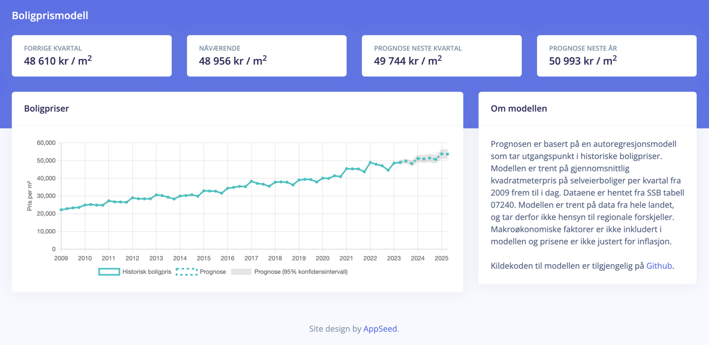

# House Price Model
A simple autoregression model for predicting house prices in Norway based on publicly available data. The model is deployed using Flask and is available at [TBD](TBD). 

# Getting started
This project is built using Anaconda with the environment defined in `environment.yaml`. See the [Anaconda documentation](https://docs.anaconda.com/free/anaconda/install/index.html) for how to install Anaconda and set up the environment.

### Running a test server
To run a Flask development server, run `flask run` from the root directory. The server will be available at `http://localhost:5000`. Note that this requires the environment variable `FLASK_APP=app/run.py` to be set.

### Running a production server
To run the server in production using gunicorn, run `gunicorn -b 0.0.0.0:8000 app.run:app` from the root directory.

### Running tests
Tests are written using pytest and are located in `tests/`. Run `pytest` to run the full test suite.

### Running notebooks
The analysis behind the forecasting model is done using jupyter notebook. Run `jupyter notebook` and open the `notebooks/trend_analysis.ipynb` notebook to see the analysis.
